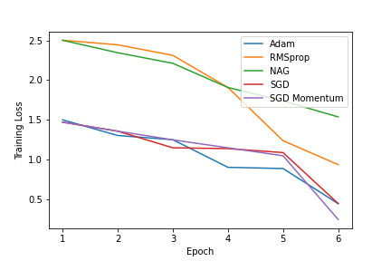

# Question Answering on the Squad Dataset

•SQuAD belongs to a subdivision of QA known as extractive question answering, often also referred to as reading comprehension. Its data is formed from triples of question, passage and answer. When an extractive QA system is presented a question and a passage, it is tasked with returning the string span from the passage which answers the question.
The Squad creaters proposed this dataset as a means for networks to actually understand the text they were being interrogated about rather than simply being extractive papers.

•The base BERT model has 12 transformer
encoder layers that terminate in an interchangeable final layer which can be finetuned to the specific task. We chose this network as our baseline because of its use of contextual embeddings and global attention and because of the speed advantage derived from an RNN free architecture

•The base BERT network, the baseline for this project, is built with 12 Transformer encoder blocks.
These encoder blocks contain multi-head attention and a feed forward network. Each head of the
multi-head attention attends to the concatenation of the context and query input and thus forms a
global attention output. The output of each Transformer encoder is fed in to the next layer, creating
an attention hierarchy. 

## Data:

The Stanford Question Answering Dataset (**SQuAD**) is a reading comprehension dataset consisting of questions posed by crowdworkers on a set of Wikipedia articles. The answer to every question is a segment of text, or span, from the corresponding reading passage. There are 100,000+ question-answer pairs on 500+ articles.
The dataset can be downloaded from:
The dataset contains the columns:

**Title**: The Title for each question and answer pair.

**Context**: The context of the news article. 

**Question**: The question regarding the context.

**Answers**: The answer to each question.

To fine-tune BERT for a Question-Answering system, it introduces a start vector and an end vector. The probability of each word being the start-word is calculated by taking a dot product between the final embedding of the word and the start vector, followed by a softmax over all the words. The word with the highest probability value is considered.

## Experiments:
#### **BERT:**

- A baseline was created using the BERT model. Training the model with an **Adam optimizer** with learning rate of **5e-5** for **6 epochs** yielded an **Exact Match(EM)** of **68%** and an **F1 Score** of **64.**

#### **DistilBERT**

- The DistilBERT model was fine tuned on the data. Training the model with an **Adam optimizer** with learning rate of **5e-5**, yielded an **Exact Match(EM)** of **70%** and an **F1 Score** of **62**.

#### **RoBERTa**

- The RoBERTa model was fine tuned on the data.Training the model with an **Adam optimizer** with learning rate of **5e-5**,  for **6 epochs** yielded an **Exact Match(EM)** of 72% and an **F1 Score** of **74**.

**Hyperparameter Tuning**

Below are the hyperparameters that have been used for the BERT base uncased model:

1. **Max Sequence length** - 512
2. **Batch Size** - 32
3. **Number of epochs** - 6

| Model | Epochs | Exact Match(EM) | F1 Score(Weighted) |
| ----- | ------ | -------- | ------------------ |
|BERT | 6 | 68 | 64|
|DistilBERT | 6 | 70 |62|
|RoBERTa  | 6 | 72 |74|

**Evaluation Method**
To evaluate our models we use the standard SQuAD performance metrics: Exact Match (EM) score and F1 score.

• **Exact Match**: A binary measure of whether the system output matches the ground truth answer exactly.

• **F1**: Harmonic mean of precision and recall, where precision = (true positives) / (true positives + false positives) and recall = true positives / (false negatives + true positives).

    
Considering the **RoBERTa** model a detailed analysis of the optimizers used for training has been done.
The table lists out the different optimizers and thier parameters used in training.

The following research paper has been used for fine tuning the optimizers: [[2]](https://arxiv.org/pdf/1910.05446.pdf)

Optimizer | Learning Rate $\gamma$ |   Momentum $\eta$ | Alpha $\alpha$ | Beta1 $\beta_1$ | Beta2 $\beta_2$ | Epsilon $\epsilon$ |
| ---     | ---                    | ---               | ---            | ---             | ---            | ---                |
AdamW     | 5e-5                   | 0.01              | 0.9            | 0.9             | 0.999          | 1e-5               |
RMSprop   | 0.01                   | 0.01              | 0.99           | -               | -              | 1e-5                |
NAG       | 5e-5 |                 | 0.01              | -              | -               |-               | 1e-5                  |   
SGD(Momentum)| 5e-5                | 0.001             | -              |  -              |-               | 1e-5                  |
SGD          | 0.01 |              |                   |                 |                |                | 1e-5                   |

    
**Comparing the Training loss of all optimizers**
 

**Comparing the Validation loss of all optimizers**
 

The rate of convergence of the Adam optimizer is the fastest.

We can conclude the **Empirical Order of convergence** of the optimizers:
AdamW > RMSprop > NAG > SGD (Momentum) > SGD
References:

[1] [Question and Answering on SQuAD 2.0: BERT Is All You Need](https://web.stanford.edu/class/archive/cs/cs224n/cs224n.1194/reports/default/15812785.pdf)

[2] [On Empirical Comparisons of Optimizers for Deep Learning](https://arxiv.org/pdf/1910.05446.pdf)

[3] [The Marginal Value of Adaptive Gradient Methods in Machine Learning](https://arxiv.org/pdf/1705.08292.pdf)

[4] [Dissecting Adam: The Sign, Magnitude and Variance of Stochastic Gradients](https://arxiv.org/pdf/1705.07774.pdf)
