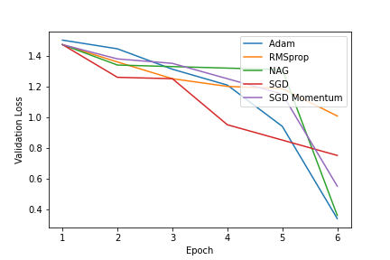

# QA_squad_test
Question Answering on the Squad Dataset

•SQuAD belongs to a subdivision of QA known as extractive question answering, often also referred to as reading comprehension. Its data is formed from triples of question, passage and answer. When an extractive QA system is presented a question and a passage, it is tasked with returning the string span from the passage which answers the question.
The Squad creaters proposed this dataset as a means for networks to actually understand the text they were being interrogated about rather than simply being extractive papers.
•The base BERT model has 12 transformer
encoder layers that terminate in an interchangeable final layer which can be finetuned to the specific task. We chose this network as our baseline because of its use of contextual embeddings and global attention and because of the speed advantage derived from an RNN free architecture

•The base BERT network, the baseline for this project, is built with 12 Transformer encoder blocks.
These encoder blocks contain multi-head attention and a feed forward network. Each head of the
multi-head attention attends to the concatenation of the context and query input and thus forms a
global attention output. The output of each Transformer encoder is fed in to the next layer, creating
an attention hierarchy. 

## Data:
**Squad Dataset**:

The Stanford Question Answering Dataset (SQuAD) is a reading comprehension dataset consisting of questions posed by crowdworkers on a set of Wikipedia articles. The answer to every question is a segment of text, or span, from the corresponding reading passage. There are 100,000+ question-answer pairs on 500+ articles.

The dataset contains the columns
Id: a string feature.

Title: a string feature.

Context: a string feature.

Question: a string feature.

Answers: a dictionary feature containing:

Leverage the two datasets in the following way:
• train (129,941 examples): All taken from the official SQuAD 2.0 training set.
• dev (6,078 examples): Half of the official dev set, randomly selected.
• test (5,921 examples): The rest of the official dev set, plus hand-labeled examples.

To fine-tune BERT for a Question-Answering system, it introduces a start vector and an end vector. The probability of each word being the start-word is calculated by taking a dot product between the final embedding of the word and the start vector, followed by a softmax over all the words. The word with the highest probability value is considered.

## Experiments:
#### **BERT:**

- A baseline was created using the BERT model. Training the model with an **Adam optimizer with learning rate of 5e-5** for **6 epochs** yielded an **Accuracy of 86% and an F1 Score of 0.86.**

#### **DistilBERT**

- The DistilBERT model was fine tuned on the data. Training the model with an **AdamW optimizer with learning rate of 5e-5**, yielded an **Accuracy of 82% and an F1 Score of 0.81.**

#### **FINBERT**

- The FINBERT model was fine tuned on the data.Training the model with an **Adam optimizer** with learning rate of 5e-5,  for **6 epochs** yielded an **Accuracy of 90.91% and an F1 Score of 0.91.**

**Hyperparameter Tuning**

Below are the hyperparameters that have been tweaked for BERT base uncased:

1. **Number of Directed co-Attention layers** - We tried various numbers of layers and we found
out that N=7 for the co-attention layers gave us optimal performance while being able to fit
the model on 2 GPUs (3 F1 score improvement by itself).
2. **Max Sequence length** - After initial experiments with default sequence length (context + query token) 384, we switched to a sequence length of 512. This gave us a 0.6 F1
improvement on our model.
3. **Batch Size** - Default: 12, We had to use a batch size of 6 for all our experiments due to
resource constraints and out of memory issues on the GPU for any larger batch size.
4. **Number of epochs** - Default: 2 On increasing the number of epochs we saw a significant
degradation in performance (-3 F1 score), we attribute this to the fact that the model starts
to overfit to the training data with high variance and since the batch size is smaller the
gradient updates could be noisy not allowing it to optimally converge.
5. **Learning Rate** - Default: 3e-5 We wrote a script to help us find the optimal learning rate
using grid search and found the optimal learning rates for SQuAD 2.0 and SQuAD 2.Q
respectively for batch size of 6.

> Fine Tuning of the model has been referencing the paper: "[Question and Answering on SQuAD 2.0: BERT Is All
You Need](https://web.stanford.edu/class/archive/cs/cs224n/cs224n.1194/reports/default/15812785.pdf))".

| Model | Epochs | EM | F1 Score(Weighted) |
| ----- | ------ | -------- | ------------------ |
|BERT | 6 | 70 | 76|
|DistilBERT | 6 | 86% |0.86|
|Roberta  | 6 | 76% |0.74|

**Evaluation Method**
To evaluate our models we use the standard SQuAD performance metrics: Exact Match (EM) score
and F1 score. For our project, we focus on the EM and F1 scores with respect to the dev set.

• **Exact Match**: A binary measure of whether the system output matches the ground truth
answer exactly.

• **F1**: Harmonic mean of precision and recall, where precision = (true positives) / (true
positives + false positives) and recall = true positives / (false negatives + true positives).

    
Considering the FinBERT model a detailed analysis of the optimizers used for training has been done.
The table lists out the different optimizers and thier parameters used in training.

The following research paper has been used for fine tuning the optimizers: [On Empirical Comparisons of Optimizers for Deep Learning](https://arxiv.org/pdf/1910.05446.pdf)

Optimizer | Learning Rate $\gamma$ | | Momentum $\eta$ | Alpha $\alpha$ | Beta1 $\beta_1$ | Beta2 $\beta_2$
| --- | --- | --- | --- | --- | --- | --- |
AdamW | 5e-5 |    |     |     | 10e-3 |10e-4|
RMSprop | 0.01 | 0.01 | 0.99|     | 10e-3  | 10e-5|
NAG | 5e-5 |
SGD(Momentum)| 5e-5 | 0.001|
SGD   | 0.01 | 

    
**Comparing the Training loss of all optimizers**
 

**Comparing the Validation loss of all optimizers**
 

The rate of convergence of the Adam optimizer is the fastest.

We can conclude the **empirical order of convergence** of the optimizers:
AdamW > RMSprop > NAG > SGD (Momentum) > SGD
